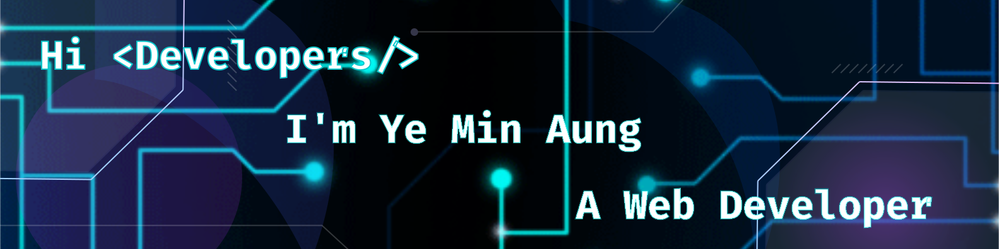

## 💫 About Me:

- 👨‍🎓 I’m currently an engineering student at [MIIT](https://www.miit.edu.mm)
- 🌱 I’m learning **NextJS**
- 💬 Ask me about **NextJS**
- 👀 I’m looking to collaborate with other developers
- ⚡ Fun fact **I am power ranger🤪.**

## 💻 Languages and Tools:

<!--  -->
<!--  -->
<!--  -->
<!--  -->
<!--  -->
<!--  -->
<!--  -->
<!--  -->
<!--  -->
<!--  -->
<!--  -->
<!--  -->
<!--  -->
<!--  -->
<!--  -->
<!--  -->
<!--  -->

## 🤪

<picture>
  <source media="(prefers-color-scheme: dark)" srcset="https://raw.githubusercontent.com/mryeminaung/mryeminaung/output/github-snake-dark.svg" />
  <source media="(prefers-color-scheme: light)" srcset="https://raw.githubusercontent.com/mryeminaung/mryeminaung/output/github-snake.svg" />
  
</picture>

## How to reach me

<!--
**mryeminaung/mryeminaung** is a ✨ _special_ ✨ repository because its `README.md` (this file) appears on your GitHub profile.

&nbsp;

- 📫 How to reach me **yeminaung013@gmail.com**
Here are some ideas to get you started:
- 🤔 I’m looking for help with ...
- 💬 Ask me about ...
- 📫 How to reach me: ...
- 😄 Pronouns: ...
- ⚡ Fun fact: ...
--!>
