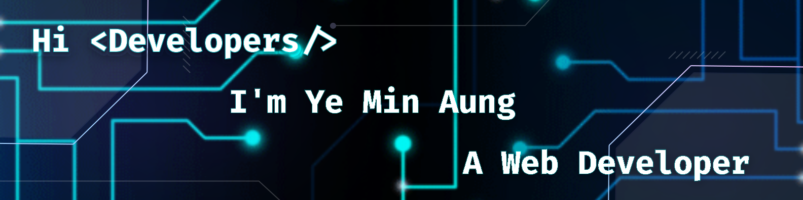

<!--  -->

# 💫 Hi there! I'm Ye Min Aung 

### **`Junior Web Developer`**

- 👨‍🎓 I’m currently an engineering student at [MIIT](https://www.miit.edu.mm)
- 💬 Ask me about **React, NextJS, Laravel, and web development**  
- 👀 I’m looking to collaborate with other developers
- 📧 Open to **Internship and Junior Developer roles**: Contact me at **[yeminaung.dev@gmail.com](mailto:yeminaung.dev@gmail.com)**

<!-- Profile Views -->
<!-- 

  

 -->

## 💻 `Languages & Frameworks`
 
 
 
 
 
 
 
 
 
 
 

## 🛠 `Tools`
 
 
 
 
 
 

 
 

## 🚀 `Deployment`
 
 
 
 

## 👀 `How to reach me`

## 📊 `GitHub Stats`

<picture>
  <source media="(prefers-color-scheme: dark)"
    srcset="https://github-readme-stats.shion.dev/api?username=mryeminaung&show_icons=true&hide_border=true&theme=tokyonight&border_radius=15">
  <source media="(prefers-color-scheme: light)"
    srcset="https://github-readme-stats.shion.dev/api?username=mryeminaung&show_icons=true&hide_border=true&theme=default&border_radius=15">
  
</picture>

<picture>
  <source media="(prefers-color-scheme: dark)"
    srcset="https://streak-stats.demolab.com?user=mryeminaung&theme=tokyonight&hide_border=true&border_radius=15">
  <source media="(prefers-color-scheme: light)"
    srcset="https://streak-stats.demolab.com?user=mryeminaung&theme=default&hide_border=true&border_radius=15">
  
</picture>

<!-- Contribution Graph -->
<picture>
  <source media="(prefers-color-scheme: dark)"
    srcset="https://github-readme-activity-graph.vercel.app/graph?username=mryeminaung&theme=tokyo-night&hide_border=true&radius=15">
  <source media="(prefers-color-scheme: light)"
    srcset="https://github-readme-activity-graph.vercel.app/graph?username=mryeminaung&theme=github-light&hide_border=true&radius=15">
  
</picture>

## 🤓 `Just for Fun`
<picture>
  <source media="(prefers-color-scheme: dark)" srcset="https://raw.githubusercontent.com/mryeminaung/mryeminaung/output/github-snake-dark.svg" />
  <source media="(prefers-color-scheme: light)" srcset="https://raw.githubusercontent.com/mryeminaung/mryeminaung/output/github-snake.svg" />
  
</picture>

<!-- Proudly created with GPRM ( https://gprm.itsvg.in ) -->

<!--
**mryeminaung/mryeminaung** is a ✨ _special_ ✨ repository because its `README.md` (this file) appears on your GitHub profile.

&nbsp;

- 📫 How to reach me **yeminaung013@gmail.com**
Here are some ideas to get you started:
- 🤔 I’m looking for help with ...
- 💬 Ask me about ...
- 📫 How to reach me: ...
- 😄 Pronouns: ...
- ⚡ Fun fact: ...
--!>
